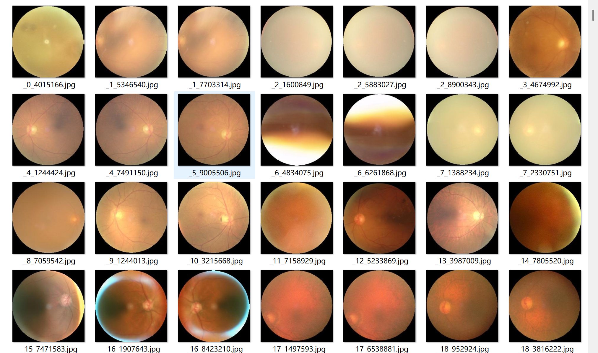
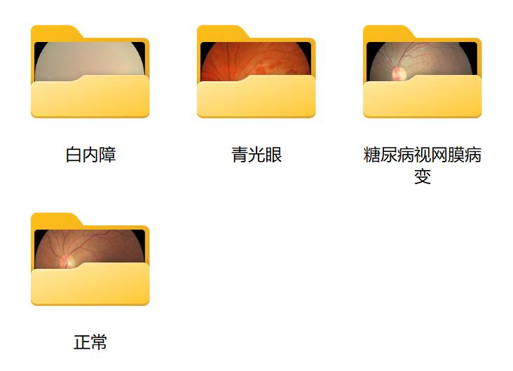
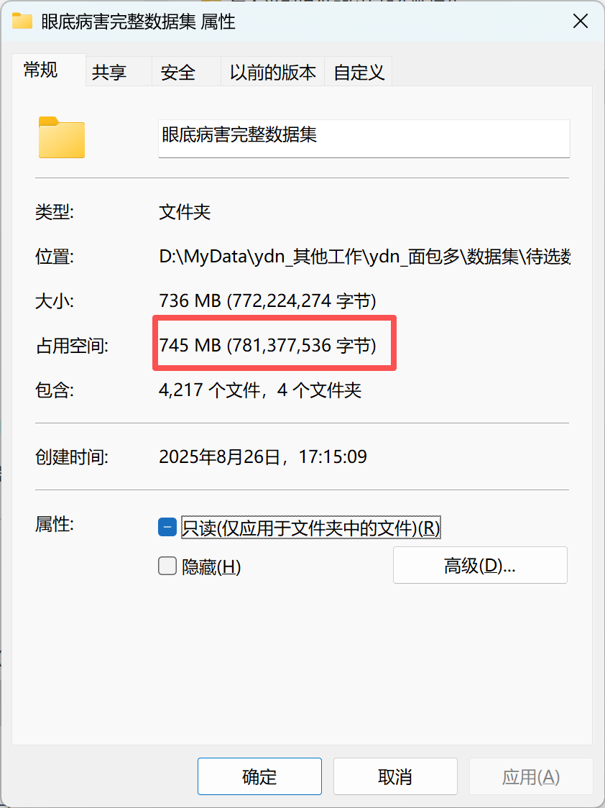
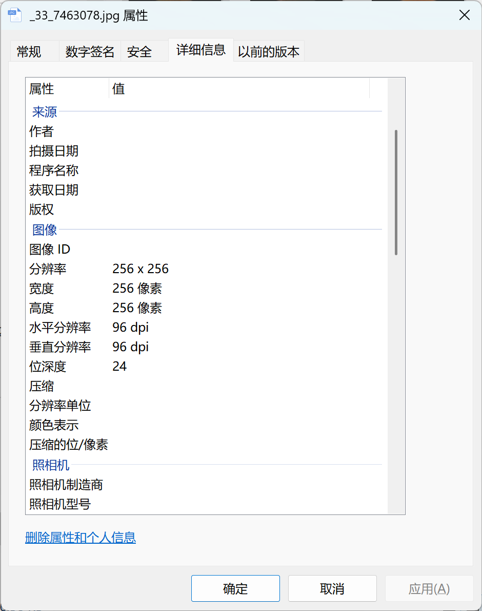

# Retinal Diseases Dataset for Image Classification

Original dataset information:  
- In the folder "Normal", there are 1074 images.
- In the folder "Cataracts", there are 1038 images.
- In the folder "Diabetic Retinopathy", there are 1098 images.
- In the folder "Glaucoma", there are 1007 images.
- The total number of images in all subfolders is 4217.

## Images

Here is a pay link on Stripe ( https://buy.stripe.com/3cs8yP7sY87d0vu9AB ). Please contact me lonlonago@foxmail.com after funding $89, and I will send you a complete data files , thank you!

